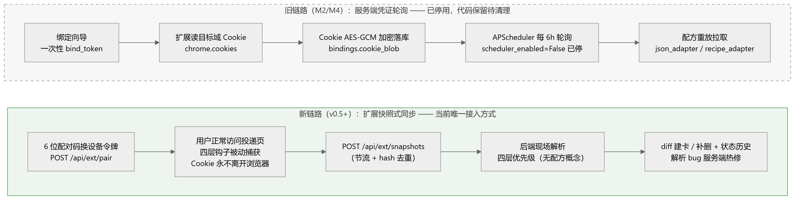
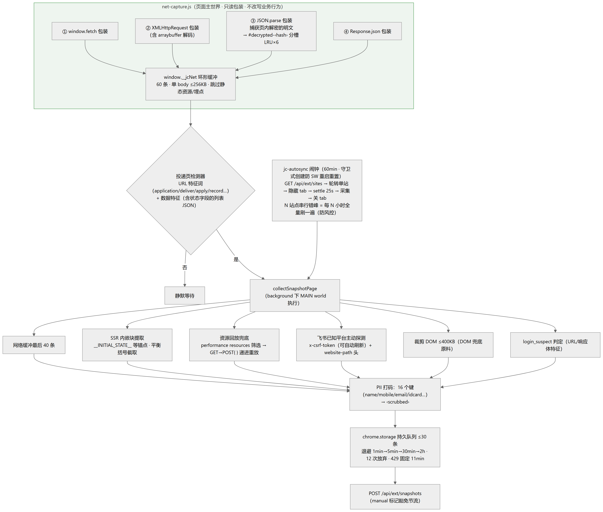

# JobCheck 开发记：把秋招投递收进一张看板

秋招求职者的一天是这样的：早上投三家公司，中午刷两场笔试，晚上打开十几个浏览器标签页——腾讯的、网易的、携程的、某个用飞书 ATS 的、另一个用 Moka 的——挨个登录，看看哪家的状态从「简历评估」变成了「面试」，再手动抄回飞书多维表格里。状态文案每家都不一样，有写「初筛通过」的，有只给一个数字码的，还有整个接口都是密文的。

JobCheck 就是冲着这件事来的：**一个多用户的岗位投递状态追踪平台**。你把它做成浏览器扩展装上，之后正常去各公司官网看投递进度，扩展在旁边被动采集页面数据，平台现场解析、归一化成一个统一状态机，所有投递自动出现在一张看板上；没法自动抓的渠道就手动记，两种来源混排展示。

这篇文章记录它的核心设计与开发过程中最有价值的部分——一次彻底的架构转折，和真实站点接入时的一串事故复盘。

## 要解决的问题与产品红线

先做了一轮竞品调研，结论很有意思：国外的 Huntr、Teal 只做「一键捕获职位 + 手动管状态」；国内的产品（Offer情报局、OfferLink 等）清一色是「网申自动填表 + 手动进度管理」。也就是说，**「自动聚合各门户投递状态」这件事，市场上没人做**——国内秋招用户还在用飞书多维表格手动追几十个投递点，痛点真实存在。

产品定位是个人运营的小平台：邀请码注册、目标境内轻量云 2C4G、SQLite、不超过 50 个用户。但小平台不代表可以没有边界，开工前先立了四条不可协商的红线：

1. **只读**：绝不代投简历、绝不自动投递、绝不自动沟通；
2. 适配器规范禁止请求任何写操作端点；
3. 用户可一键注销并级联删除全部数据（含 Cookie）；
4. 不存储简历文件；遇验证码不破解。

这四条红线后来多次影响技术决策——比如扩展对所有页面网络栈只做**只读包装**、绝不改写业务行为，就是红线 1 的直接延伸。

## 技术栈

| 层 | 选型 |
|---|---|
| 后端 | Python 3.12 / FastAPI / SQLAlchemy 2 / Pydantic v2 / SQLite（WAL + 外键） |
| 前端 | Vue 3 / Vite / TypeScript / Pinia / Naive UI（浅色定制主题） |
| 扩展 | Chrome/Edge Manifest V3（service worker + alarms，MAIN world 内容脚本） |
| 安全 | Argon2id 密码哈希、签名 Cookie 会话、AES-256-GCM、PII 打码 |
| LLM | OpenAI 兼容协议自写薄客户端，默认离线 heuristic 提供者（零成本） |
| 测试 | pytest 143 项 + 13 个 golden 样本回归 |

规模约束决定了选型：50 个用户以内、SQLite + WAL 足够，同时保留迁 PostgreSQL 的路径，不为了「看起来像大系统」引入多余组件。

## 最大的一次转折：从「服务端轮询」到「浏览器作为兼容层」

项目最初走的是一条看起来很自然的路线：**扩展上传 Cookie + 服务端定时轮询重放配方**。用户在向导里选一个门户，扩展读出该域的 Cookie 回传，服务端加密存库，之后 APScheduler 每 6 小时拿配方去服务器上重放一遍接口，把投递列表拉回来。

这套架构在 M2/M4 阶段跑通了核心闭环，然后在真实站点面前连环碰壁。2026-09-01 对四个真实站点做接入复盘，结论是：**3.5/4 次失败发生在采集层**——服务端或扩展与站点对话的那个环节。配方管线本身（结构指纹、回放验证、发布）没输过一场，输的全是「怎么拿到数据」：

- 站点的 CSRF token 会轮换，重放配方要加自愈逻辑；
- 有的端点对 POST 返回 405，每接一个站就要修一次后端；
- 分页协议、请求头约定、登录态校验……每家的契约都不同，服务端重放等于要在后端模拟一个浏览器，还是每站手修的那种。

再去看业界怎么做：Huntr、Teal、JobRight、国内的同类产品、甚至 Distill 这类网页监控，无一例外——**数据在用户访问时采集，服务端不存凭证轮询**。于是有了 2026-09-01 的架构重构，核心原则一句话：

> **浏览器作为兼容层，Cookie 永不离开浏览器。**

新链路变成：扩展在用户正常访问投递页时，被动捕获页面自己产生的数据（接口响应、页面里解密出的明文、渲染后的 DOM），整包作为「快照」上报；后端**现场解析**快照，不存在任何「配方重放」。

新旧对比：

| 维度 | 旧链路（已停用） | 新链路（现行） |
|---|---|---|
| 凭证 | Cookie 加密存服务端 | Cookie 不离开浏览器 |
| 抓取时机 | 服务端定时轮询（6h） | 用户访问时 + 扩展每小时静默回访 |
| 站点适配 | 预生成配方重放，契约脆弱 | 现场解析快照，解析逻辑可服务端热修 |
| 适配成本 | 每站修一次后端 | 平台规格/启发式自动覆盖，hints 自学习 |

这个转折带来一个极其重要的副产品：**解析 bug 服务端热修，不再发插件**。浏览器扩展一旦发出去，用户手里就固化了一个版本，改采集逻辑要用户手动重载；而把「理解数据」的全部判断搬到后端之后，扩展只负责搬运原料，出了解析问题改服务端代码、下一个快照上来就是新逻辑。

> [!IMPORTANT]
> 采集系统的脆弱性集中在「与目标站点的对话」这一层。让真实浏览器替你和站点对话（登录、CSRF、加密、风控全由它处理），你只读它产生出来的结果——比在自己服务器上模拟一个浏览器稳定得多。

## 扩展端：四层只读采集钩子

扩展是 MV3 结构：`net-capture.js` 以 `document_start + world: MAIN` 注入所有 http(s) 页面，对页面的网络栈做只读包装。既然要「拿到页面看到的数据」，就不能只盯一处——数据可能走 fetch，可能走 XHR，可能是页面内解密后的 JSON，也可能藏在 `Response.json()` 的返回里。所以钩子铺了四层：

| 钩子 | 捕获什么 |
|---|---|
| ① `window.fetch` 包装 | 常规接口响应 |
| ② `XMLHttpRequest` 包装 | 传统站点（含 arraybuffer 解码） |
| ③ `JSON.parse` 包装 | **页面内解密后的明文** |
| ④ `Response.json()` 包装 | 走原生 C++ 解析路径的响应 |

四路汇入一个 60 条的环形缓冲（单 body 上限 256KB，自动跳过静态资源和埋点），再由「投递页检测器」判断当前页是不是「我的投递」类页面——URL 特征词（application / deliver / apply / record…）加数据特征（含状态字段的列表 JSON）双条件命中，同域 10 分钟节流。命中后由 background 统一采集：网络缓冲最后 40 条、SSR 页面的内嵌状态块（`__INITIAL_STATE__` 这类锚点 + 平衡括号截取）、资源回放兜底、已知平台主动探测、裁剪到 400KB 以内的 DOM。

### 加密站点的破局

这套设计里最有意思的是第③层。实战中遇到 Moka 系站点，接口返回的是 `{"data": "D2sYoWg+…", "necromancer": "f312…"}`——AES-256-CBC 加密，密文里什么都没有，服务端解析只能得到 `no_data`。

但换个角度想：**传输是加密的，页面终究要解密了才能渲染**。前端解密几乎都会经过 `JSON.parse`，所以只要在 `JSON.parse` 上做只读包装，就能拿到解密后的明文，落成 `#decrypted-<hash>` 槽位（内容前缀哈希分槽 + LRU 保留最近几个，避免多个解密对象互相覆盖）。传输层加密在「数据已经被页面自己解密」这个事实面前，不构成障碍。

当然它也有天花板：后来遇到一个站点（星环），解密发生在 Web Worker 里，`postMessage` 回主线程的是克隆对象——页面侧任何钩子原理上都不可见。这层天花板由最后的 DOM 兜底接手（下文详述）。

### 采集之外的工程细节

- **PII 打码**：上报前把 16 个敏感键（name / mobile / email / idcard…）的值替换为 `‹scrubbed›`，隐私数据不落库；
- **持久队列**：`chrome.storage` 里最多 30 条，指数退避重试（1min → 5min → 30min → 2h，12 次放弃，429 固定等 11 分钟）——service worker 随时会被杀，队列必须落在 storage 里；
- **每小时静默回访**：`jc-autosync` 闹钟轮转打开隐藏标签页访问已连接站点，N 个站点串行错峰，等于每 N 小时全量刷一遍，避免集中请求触发风控；
- **宽松形状门**：任何「≥1 字典且字典 ≥3 键」的数组都进候选。这是吃过亏之后的设计——**扩展不做预判**，像不像投递数据让后端说了算，预判逻辑每改一次都要发一次插件。

## 后端：四层解析引擎

快照上来之后，`services/ingest.py` 按固定优先级现场解析，任何一层成功即停：

1. **平台规格**：飞书 / 北森 / 携程 / Moka 的列表路径和状态取值硬编码在 `PLATFORM_SPECS` 里，按真实站点采样校准（比如飞书的 `operation_list` 末项 `operation_code`：`0/1` → 简历评估中，`3` → 笔试中）；
2. **portal hints**：同域名上次解析成功的 `list_json_path + field_map` 会沉淀为该门户的 hints，下次快照优先复用，失效自动作废重推——站点改版能自愈；
3. **启发式全量扫描**：递归扫描 JSON 找「像逐条投递的列表」，候选打分选优（URL 特征、applied_at、文字状态、条数），并内置**职位列表陷阱拦截**——「推荐职位」列表的键形（openedAt / pointTo / recommendationBonus…）命中即丢弃；
4. **DOM 兜底**：网络层全失败时，用 lxml 在上报的 DOM 里找「同标签同 class 的重复兄弟行组」，按状态词典、日期正则、最长文本推断每个单元格的语义。渲染出来的记录永远在 DOM 里，与加密方式、传输层完全无关——这是前文 Web Worker 站点的最终答案，网易就是从这条路第一次出卡的。

解析结果统一走 `sync.ingest_applications` 纯函数：与现有卡片 diff，新的建卡、消失的补删、状态变化写 `app_status_hist` 历史（from → to + 门户原文）。

## 统一状态机：14 态压成 6 列

各门户的状态文案千奇百怪，平台内部维护一个 14 态的扁平枚举（进行阶段 9 + 面试轮次未知兜底 1 + 终态 3 + 待确认 1），定义在 `backend/app/domain/statuses.py`，前后端经 `/api/meta` 取同一份，单一事实来源。前端展示时压缩成 6 个阶段列：

| 看板阶段列 | 包含状态 |
|---|---|
| 待确认 | pending_confirm |
| 简历评估 | screening |
| 测评/笔试 | assessment, written_test |
| 面试中 | interview_1/2/3, hr_interview, interview_unknown |
| Offer / 入职 | offer, onboarded |
| 已结束 | rejected, withdrawn, expired（可折叠） |

两条设计纪律：

- **门户原文永远保存**（`raw_status_text`）。归一化规则更新后可以对历史重放，永远不会因为规则改错而丢失原始信息。顺便，v0.6.1 我删掉了「已投递」状态——归一化几乎总把它映射到更后阶段，这一列长期是空的，无区分价值就彻底移除（原文语义不受影响）；
- **置信度不足绝不猜**。归一化链路是规则表 → 门户码表 → 通用规则 → LLM 兜底（下节），四层全不中或 LLM 置信度低于 0.7 时，状态落 `pending_confirm`，看板上原样展示门户文案，等用户确认。

## LLM：用得越少越好

这个项目里 LLM 的角色是被严格圈养的，只有两个窄用途：

- **T1 配方生成**：面对未支持的自研站点，用 LLM 从采样数据生成一份提取配方（JSONPath + 字段映射）；
- **T2 状态兜底分类**：规则表没命中的状态原文，让 LLM 分类到 14 态之一，输入控制在 1k token 以内。

围绕它有三条铁律：

1. **一切 LLM 输出必须通过确定性回放验证**。T1 生成的配方要在采样数据上过「七断言」：记录数在 1–500、关键字段非空率 100%、状态映射全覆盖、提取结果与 LLM 自述一致、选择器命中数 ≤200、登录判定可区分、**用户标识必须参数化**（配方任何位置不得出现采样用户特有的 ID）。全部通过才发布，不过自动修正回喂，两三轮还不过就拒绝建门户转手动记录——这是反幻觉的闸门，LLM 说得再好听，跑不出正确数据就不上架；
2. **LLM 输出无代码执行能力**：解释器只支持白名单原语（CSS 选择器 / JSONPath / 等待 / 滚动），天然沙箱；
3. **预算熔断**：月预算 ¥100，超限自动暂停 T1、T2 降级直标待确认。已知平台（飞书等）走结构指纹模板**零 AI 成本**，日常同步零 LLM。实际成本量级：T1 每门户一次性几分钱，全量 80 家自研站也就几十元。

> [!TIP]
> 让 LLM「理解一次」，让引擎「确定性执行」——理解阶段的智能换来的配方要能被纯代码重放，这样才能热修、能回归测试、能算清楚每一分钱。

## 实战事故复盘

真实站点的接入史就是一部事故史，每一件都修完并沉淀了回归用例。挑几件最典型的：

| 事故 | 根因 | 修复 |
|---|---|---|
| Moka 站 no_data | 响应体 AES-256-CBC 加密 | `JSON.parse` 只读包装捕获页内解密明文 → `#decrypted-*` 分槽 |
| 星环 15 张错卡 | 105KB 解密对象实为站点启动配置 / 职位列表 | 候选打分 + 职位列表陷阱拦截 + trap golden 样本 |
| 星环最终判定不可钩 | 解密在 Web Worker，postMessage 克隆对象页面不可见 | DOM 兜底路径接手 |
| 网易「数据与上次一致」 | `payload_hash` 只算 network 不算 dom | dom 纳入哈希 + 回归 |
| duplicate 误删卡不回 | 内容一致直接跳过 | duplicate 时重放 ingest diff，幂等补建 |
| `jc-autosync` 从未触发 | SW 每分钟被唤醒反复重置闹钟 | 守卫式创建 + 启动补跑 |
| popup 吞失败 | 只看 HTTP 2xx | 结果文案透传 parsed / duplicate / no_data / queued |

展开讲两个。

**星环二测：15 张「待确认」错卡。** 插件兴高采烈地显示「已识别 15 条」，看板多出 15 张待确认卡片——点开一看全是职位列表，status 清一色 `open`，真实投递反而缺席。证据在快照里：钩子捕到的那个 105KB 解密对象是站点的启动配置，顶层 `jobs` 数组恰好有 title + status + createdAt 三个键，启发式一拍即合地把「职位目录」当成了「我的投递」。修复分两端：扩展侧改宽松形状门 + 内容前缀哈希分槽（不再预判、不再互相覆盖）；后端加职位列表陷阱拦截。这个真实事故形状直接固化成了 golden 样本 `moka_jobslist_trap_like.json`——「推荐职位冒充投递记录」从此是一个永久的回归断言。

**炎魂三重叠加事故。** 一张卡片显示「企业 mokahr.com / 岗位 京公网安备 11010802024479号」——岗位名是备案号，这个画面很有喜剧效果，但根因是三个 bug 叠加：导航菜单里「我的简历」命中了状态词典的「简历」关键词，整个导航区被当成了记录组（真状态「初筛」反而不在词典里，真实记录组因无状态被丢弃）；同时星环和炎魂共用 `app.mokahr.com` 域名，两个租户被并成了一个门户。三个修复全部在服务端完成——导航词一票否决、词典补「初筛/复筛」、按 Moka URL 租户段（`site_key`）分门户——**全程未发插件**，这正是快照架构承诺的兑现。

## 质量纪律：golden 样本与 143 项测试

后端当前基线 **143 passed**（18 个测试文件），从重构前的 85 一路涨上来。比数字更重要的是一条纪律：

> 每个真实失败形态沉淀一个 golden / 回归用例，**不要修了一个丢了上一个**。

`backend/tests/golden_samples/` 现在有 13 个样本：飞书系三种形态、北森真实采样脱敏、Moka 明文与加密形态、两个「职位列表冒充投递」的陷阱样本、两个 DOM 兜底路由样本。任何解析引擎改动后跑一遍全量，这些用例保证历史上踩过的每个坑都不会再掉进去。管理后台还能对历史快照干跑重解析（`POST /api/admin/snapshots/{id}/reparse`），修完解析逻辑立刻用真实数据验证。

接入新站点的验收标准也定得很硬：**连续 3 个新真实站点零改动出卡**。目前小米（飞书 ATS 自定义域名站）全链路走通，网易从 DOM 兜底出卡，门户库里 9 家全部是真实站点（v0.6.2 把所有 mock 门户删干净了，飞书契约改用固化的 golden 样本做回归）。

## 现状与下一步

当前完成度：手动记录全链路、快照自动同步全链路（唯一接入方式）、14 态状态机与归一化、管理后台（快照链路健康度 / 捕获率 / 解析率，纯只读）、LLM 配方管线核心闭环。待办按序：真实站点继续验证、旧架构清理（删掉约 1400 行旧轮询代码和扩展里的旧流程）、境内部署 + ICP 备案、真实 LLM 提供者线上标定。

回头看这个项目，最有价值的经验有两条。一是**架构上尊重现实**：服务端模拟浏览器对抗真实站点是一场打不赢的战争，把浏览器本身当兼容层、只读地取数据，是从「每站都要修」到「大部分站自动覆盖」的分水岭。二是**质量上尊重历史**：每一次真实事故都是一个 golden 样本，测试基线从 85 涨到 143 不是为了数字好看，而是让「修一个」不再意味着「丢一个」。
